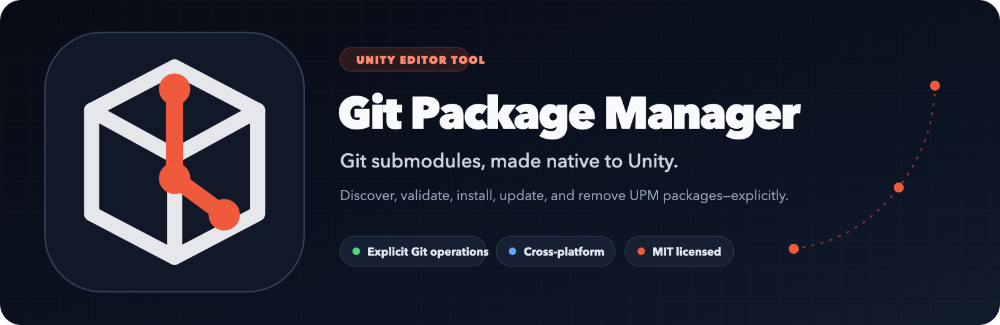
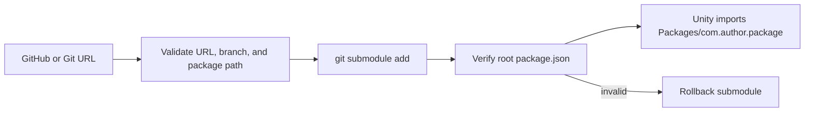

<p align="center">
  
</p>

<p align="center">
  <a href="https://github.com/martincalander/GitSubmoduleForUnity/actions/workflows/ci.yml"></a>
  <a href="https://github.com/martincalander/GitSubmoduleForUnity/releases"></a>
  
  
  <a href="LICENSE.md"></a>
</p>

<p align="center">
  A focused Unity Editor tool for discovering and managing Git repositories as
  UPM packages—always as submodules, always under <code>Packages/</code>.
</p>

---

## Why Git Package Manager?

Unity understands embedded packages, and Git understands submodules. The rough
edge is everything between them: remembering commands, validating package
layout, seeing what is installed, changing tracked branches safely, and finding
package repositories across a large GitHub account.

Git Package Manager brings that workflow into a familiar, Package
Manager-inspired editor window without hiding what Git is doing.

| | Capability | What it means |
| --- | --- | --- |
| 📦 | **UPM-first** | Managed repositories live at `Packages/com.author.package`. |
| 🌿 | **Real submodules** | Exact commits remain visible and reproducible in normal Git tooling. |
| 🔎 | **Scalable discovery** | Browse users and organizations 50 repositories at a time with server-side search. |
| 🛡️ | **Explicit operations** | No background initialization, implicit updates, credential storage, or system installers. |
| 🖥️ | **Cross-platform editor tool** | Designed for Unity on Windows, macOS, and Linux. |
| ⚡ | **Responsive by default** | CLI work runs off the editor thread; validation and branch loading are lazy. |

## Requirements

| Dependency | Status | Purpose |
| --- | --- | --- |
| Unity 2021.3+ | Required | Editor host and UPM package support |
| [Git CLI](https://git-scm.com/downloads) | Required | Every submodule operation |
| [GitHub CLI](https://cli.github.com/) | Optional, recommended | Authenticated GitHub discovery and package validation |

The tool detects missing CLIs and shows an official download link plus a
platform-appropriate command. It does **not** run Homebrew, `apt`, `winget`,
`sudo`, or downloaded scripts from inside Unity.

## Install

### Git submodule (recommended)

Run this from the Unity project root:

```bash
git submodule add \
  https://github.com/martincalander/GitSubmoduleForUnity.git \
  Packages/com.essentials.gitpackagemanager
```

Commit both `.gitmodules` and the new submodule entry.

### Unity Package Manager Git URL

In **Window > Package Manager**, choose **Add package from git URL…** and use:

```text
https://github.com/martincalander/GitSubmoduleForUnity.git
```

This installs the tool, but a Git-submodule install is more consistent when the
project already manages its own packages as submodules.

## Quick Start

1. Confirm `git --version` works.
2. Optionally install `gh` and run `gh auth login`.
3. Open **Window > Package Management > Git Package Manager**.
4. Use **In Project** to inspect, initialize, update, retarget, or remove an
   installed package.
5. Use **GitHub** to search repositories visible to your account and add a valid
   root UPM package.
6. Use the **+** menu to add any Git repository directly by URL.



## Built for Large Accounts

Discovery deliberately avoids downloading an entire user or organization:

- GitHub returns 50 repositories per page;
- search is debounced and executed server-side;
- user and organization scopes are explicit;
- root `package.json` validation runs only for the selected repository;
- branch lists load only when a branch control is opened;
- a newer search, owner, or page request supersedes stale in-flight work.

That keeps the window predictable whether an account has ten repositories or
several hundred.

## Reliability and Security

- `UseShellExecute = false`; input is not evaluated by a shell.
- Package names, branch names, URLs, and managed paths are validated.
- Mutating paths are restricted to direct `Packages/com.author.package`
  locations.
- Git credential prompts are disabled in editor processes so failures return
  instead of hanging Unity.
- Standard output and error are drained concurrently with bounded timeouts.
- Failed post-clone package validation rolls back the new submodule.
- Credentials remain owned by Git and GitHub CLI; the package stores none.

Read the [security policy](SECURITY.md) for reporting and operational details.

## Documentation

- [UPM documentation home](Documentation~/index.md)
- [Installation and prerequisites](Documentation~/installation.md)
- [User guide](Documentation~/user-guide.md)
- [Troubleshooting](Documentation~/troubleshooting.md)
- [Architecture and safety model](Documentation~/architecture.md)
- [Brand assets](Documentation~/branding.md)
- [Contributing guide](CONTRIBUTING.md)
- [Roadmap](ROADMAP.md)
- [Support](SUPPORT.md)

## Compatibility

The package targets Unity 2021.3 or newer and contains editor-only assemblies.
The process runner includes search paths for conventional Git and GitHub CLI
installations on Windows, macOS, and Linux. See the
[compatibility notes](Documentation~/installation.md#compatibility) before
reporting a platform issue.

## Contributing

Bug reports, focused improvements, documentation fixes, and cross-platform test
results are welcome. Start with [CONTRIBUTING.md](CONTRIBUTING.md) and follow the
[Code of Conduct](CODE_OF_CONDUCT.md).

## License and Attribution

Git Package Manager is open source under the [MIT License](LICENSE.md).

Created by **Martin Calander**. The MIT copyright and permission notice must be
kept with copies or substantial portions of the software. See
[NOTICE.md](NOTICE.md) and [AUTHORS.md](AUTHORS.md).

Unity and GitHub are trademarks of their respective owners. This independent
project is not affiliated with or endorsed by Unity Technologies or GitHub, Inc.
