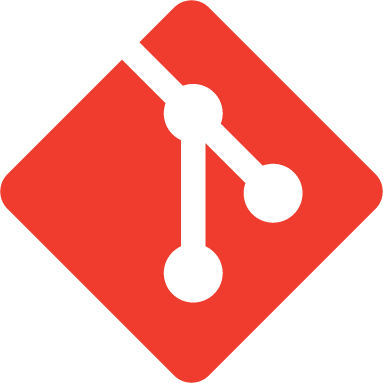

<p align="center">
  <a href="https://git-scm.com/" title="Git">
    <picture>
      
    </picture>
  </a>
  &nbsp;&nbsp;&nbsp;&nbsp;
  <a href="https://unity.com/" title="Unity">
    <picture>
      <source media="(prefers-color-scheme: dark)" srcset="https://cdn.simpleicons.org/unity/FFFFFF">
      <source media="(prefers-color-scheme: light)" srcset="https://cdn.simpleicons.org/unity/000000">
      
    </picture>
  </a>
</p>

# Git Submodule Manager

Manage Unity packages as real Git submodules, directly from the Editor.

<p align="center">
  <a href="https://github.com/martincalander/GitSubmoduleManager/actions/workflows/ci.yml"></a>
  <a href="https://github.com/martincalander/GitSubmoduleManager/releases"></a>
  
  
  <a href="LICENSE.md"></a>
</p>

Git Submodule Manager is an editor-only Unity package for installing and managing
UPM packages as Git submodules under `Packages/`. Supported Unity versions add a
native GitHub source to Package Manager, while a focused management workspace
handles Git operations. The resulting repository structure remains completely
standard and visible to normal Git tooling.

## What It Does

- Adds a native **Sources > GitHub** page on Unity versions that support Package
  Manager extension pages. It incrementally discovers valid UPM packages across
  the authenticated user's repositories and organizations, combines them with
  installed GitHub submodules, and uses Unity's package list, search, sort,
  selection, and details UI.
- Adds a discovered package as a submodule from the native details pane. The
  action uses the repository's default branch and retains the same validation,
  postcondition checks, and safe rollback as the management workspace.
- Adds **+ > Install package as Git Submodule...** to Package Manager wherever
  it is open. After a repository URL is entered, a Git-only probe fills the
  root `package.json` package name and default branch and offers the remote
  branches without requiring GitHub CLI. A trust confirmation precedes the
  shared transaction; failed additions are rolled back whenever cleanup
  ownership can be proven.
- Labels those packages as **Submodule** in Package Manager and identifies
  GitHub-hosted repositories as the **GitHub** source with the Git icon.
- Keeps the full installed-package management, GitHub discovery, add, update,
  retarget, and remove workspace at **Window > Package Management > Git
  Submodule Manager**.
- Falls back to that workspace embedded in Package Manager on older supported
  Unity versions.
- Adds a package from a secure HTTPS or SSH repository URL, or from an explicit
  local repository path.
- Discovers repositories from GitHub users and organizations when `gh` is
  available.
- Validates that a repository contains a root UPM `package.json` before keeping
  it installed.
- Initializes, updates, retargets, and removes submodules using explicit user
  actions.
- Supports Windows, macOS, and Linux Editor environments.

It does not replace Git, store credentials, silently install command-line
tools, or manage packages outside `Packages/`.

## Requirements

| Dependency | Requirement | Used for |
| --- | --- | --- |
| Unity | 2021.3 or newer | Editor host and UPM support |
| [Git CLI](https://git-scm.com/downloads) | Required | All submodule operations |
| [GitHub CLI](https://cli.github.com/) | Optional, recommended | Authenticated repository discovery |

Git must be available to the Unity Editor process. GitHub CLI is needed only
for GitHub repository discovery. If a tool is missing, Git Submodule Manager
shows an official installation link and a platform-specific command. On
supported macOS and Windows setups, it can run that native command only after
showing it and receiving your explicit confirmation. Linux installation stays
in your terminal so administrator prompts remain visible. The first time the
management workspace is opened in a project, a guided setup page checks both
tools and offers the same install actions. If `gh` is installed but not
authenticated, the page can start GitHub CLI's device login, open GitHub's
device page, and verify the resulting session. One-click login requires GitHub
CLI 2.79.0 or newer; older versions keep a compatible visible-terminal command
available.

## Installation

Open **Window > Package Manager**, select **Add package from git URL…**, and
enter:

```text
https://github.com/martincalander/GitSubmoduleManager.git
```

Git Submodule Manager itself is installed as a UPM Git dependency. Packages
managed by the tool are still added to the project as Git submodules.

## Usage

1. On supported Unity versions, open **Window > Package Manager** and select
   **GitHub** under **Sources**. Valid packages discovered from your personal
   repositories and organizations appear incrementally beside installed GitHub
   submodules in Unity's native package list and details UI. Organization
   headers, **Public**/**Private** badges, and Unity's native loading indicator
   make the catalogue state visible while it is being populated.
2. Select a discovered package and choose **Add as Submodule** to install its
   default branch, or use **Refresh** to rescan GitHub and the project.
3. Open **Window > Package Management > Git Submodule Manager** for the full
   management, discovery, add, update, retarget, and remove workspace. On older
   Unity versions, this menu opens the embedded Package Manager fallback.
4. Complete the one-time setup page. Git is required; GitHub CLI is optional
   but recommended for repository discovery.
5. If prompted, install Git or GitHub CLI with explicit approval, then choose
   **Authenticate with GitHub...** to complete the browser login.
6. Use **In Project** to manage installed package submodules.
7. From any open Package Manager page, choose **+ > Install package as Git
   Submodule...** to add a repository directly by URL. Git inspects the remote
   package name, default branch, and available branches before enabling those
   fields.

Every mutating operation requires an explicit action and confirmation. Progress,
command failures, validation results, and recovery instructions are reported in
the Editor.

## Repository Discovery

The native **Sources > GitHub** catalogue walks every repository page for the
authenticated user and each visible organization. It validates root
`package.json` files in bounded batches and publishes only confirmed UPM
packages as results become available. **Refresh** starts a new project and
GitHub scan.

The embedded management workspace retains its interactive discovery controls
for older Unity versions and detailed repository browsing:

- results are requested 50 repositories at a time;
- searches execute through the GitHub API rather than filtering a full local
  download;
- owner, search, and page changes cancel stale in-flight results;
- package validation normally runs only for the selected repository;
- the **Valid UPM Packages** filter checks the current page in small batches
  and shows only repositories with a valid root manifest;
- branch information is loaded only when requested.

Without GitHub CLI, direct Git URLs and installed-submodule management remain
available. The native GitHub source continues to show installed submodules when
remote discovery cannot start, and the embedded management fallback remains
available. Git is the only dependency used by direct URL installation; `gh` is
required only for authenticated repository discovery.

## Safety Model

- Managed paths must be direct children of `Packages/` with a valid
  `com.author.package` name.
- Network repositories must use HTTPS or SSH (including SCP-style SSH URLs).
  Plaintext `http://` and `git://` transports are rejected to prevent an
  in-transit repository substitution; explicit local and `file://` repositories
  remain supported.
- Commands are executed without a shell, so repository input is not evaluated
  as shell syntax.
- Git credential prompts are disabled inside Editor processes to prevent Unity
  from hanging on hidden interactive input.
- Standard output and error are drained concurrently and operations use bounded
  timeouts.
- A newly cloned repository is rolled back when its root package validation
  fails. The manifest must be a regular, bounded UTF-8 file with a reverse-domain
  package name and a SemVer 2.0 version.
- Persisted `.gitmodules`, local Git configuration, and worktree origins are
  revalidated before a mutation, and incomplete structural Git output fails
  closed instead of being partially trusted.
- Network-heavy add and update operations run off the Editor UI thread, and
  failed additions clean safe partial-clone artifacts or report exact manual
  recovery steps.
- Credentials remain under the control of Git and GitHub CLI.
- Missing CLI tools are never installed silently; the exact native command is
  shown in a confirmation dialog before it can run.

See the [architecture and safety model](Documentation~/architecture.md) and
[security policy](https://github.com/martincalander/GitSubmoduleManager/blob/main/.github/SECURITY.md)
for implementation and reporting details.

## Documentation

- [Installation and compatibility](Documentation~/installation.md)
- [User guide](Documentation~/user-guide.md)
- [Troubleshooting](Documentation~/troubleshooting.md)
- [Architecture and safety model](Documentation~/architecture.md)
- [Contributing](https://github.com/martincalander/GitSubmoduleManager/blob/main/.github/CONTRIBUTING.md)
- [Support](https://github.com/martincalander/GitSubmoduleManager/blob/main/.github/SUPPORT.md)
- [Governance](https://github.com/martincalander/GitSubmoduleManager/blob/main/.github/GOVERNANCE.md)
- [Maintainers](https://github.com/martincalander/GitSubmoduleManager/blob/main/.github/MAINTAINERS.md)
- [Releasing](https://github.com/martincalander/GitSubmoduleManager/blob/main/.github/RELEASING.md)
- [Roadmap](Documentation~/roadmap.md)
- [Changelog](CHANGELOG.md)

## Contributing

Bug reports, documentation corrections, focused improvements, and
cross-platform test results are welcome. Read
[CONTRIBUTING.md](https://github.com/martincalander/GitSubmoduleManager/blob/main/.github/CONTRIBUTING.md)
before opening a pull request and follow the
[Code of Conduct](https://github.com/martincalander/GitSubmoduleManager/blob/main/.github/CODE_OF_CONDUCT.md).

## License

Distributed under the [MIT License](LICENSE.md).

Copyright (c) 2026 Martin Calander. The copyright and permission notice must be
retained with copies or substantial portions of the software. Additional
attribution information is available in [NOTICE.md](NOTICE.md) and
[AUTHORS.md](AUTHORS.md).

Git and the Git logo are either registered trademarks or trademarks of Software
Freedom Conservancy, Inc., corporate home of the Git Project. The Git logo was
created by Jason Long and is licensed under
[CC BY 3.0](https://creativecommons.org/licenses/by/3.0/).

Git Submodule Manager is not sponsored by or affiliated with Unity Technologies
or its affiliates. Unity and the Unity logo are trademarks or registered
trademarks of Unity Technologies or its affiliates in the U.S. and elsewhere.
GitHub is a trademark of GitHub, Inc. This project is not endorsed by any of
those trademark owners.
