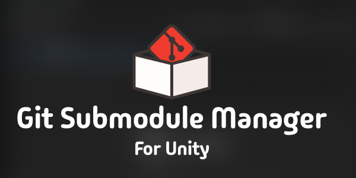

<p align="center">
  
</p>

# Git Submodule Manager

Manage Git-hosted Unity packages from Unity's native Package Manager.

<p align="center">
  <a href="https://github.com/martincalander/GitSubmoduleForUnity/actions/workflows/ci.yml"></a>
  <a href="https://github.com/martincalander/GitSubmoduleForUnity/releases"></a>
  
  
  <a href="LICENSE.md"></a>
</p>

If NuGetForUnity makes NuGet packages feel at home in Unity, Git Submodule
Manager does the same for Git submodules. It brings Git-hosted UPM packages into
Unity's own Package Manager, where you can browse GitHub repositories, install a
package as an editable submodule or read-only Git dependency, and switch
eligible packages between the two modes without leaving the Editor.

## Highlights

- Browse authenticated GitHub repositories under **Sources > GitHub**, with
  native search, sorting, refresh, loading state, and filters for downloaded
  packages, visibility, and organization.
- Install a discovered package from one **Install** menu as either a Git
  submodule or a read-only package. Branch selection prefers `main` when present.
- See organization groups and **Public** or **Private** repository badges in the
  native package list.
- Add a repository directly with **+ > Install package as Git Submodule...**.
- Convert eligible packages or uninstall submodules from Package Manager's
  native **Manage** menu.
- Validate root `package.json` files and Unity `package.json.meta` markers, then
  resolve missing dependencies before making changes.

## Requirements

| Dependency | Requirement |
| --- | --- |
| Unity | Exact `6000.3.22f1` and `6000.5.*f1` final releases; Unity `6000.4` is not supported |
| [Git](https://git-scm.com/downloads) | Required for package operations |
| [GitHub CLI](https://cli.github.com/) | Optional; required only for authenticated GitHub discovery |

The UPM manifest declares `6000.3.22f1` as its minimum eligibility version.
Unity manifests cannot encode the non-contiguous support matrix above, so that
minimum does not make Unity `6000.4` a supported target.

Git and GitHub CLI must be available to the Unity Editor process. The Welcome
window and **Preferences > Git Submodule Manager** show installation,
authentication, and version status. The package is Editor-only and supports
Windows, macOS, and Linux.

## Installation

In **Window > Package Management > Package Manager**, choose **+ > Install
package from git URL...** and enter:

```text
https://github.com/martincalander/GitSubmoduleForUnity.git#v0.8.0
```

This URL pins the published `0.8.0` release. Omitting `#v0.8.0` follows the
mutable `main` branch and is intended only for development.

## Quick Start

1. Open Package Manager and select **GitHub** under **Sources**.
2. Filter or search the catalogue, then select a package and branch.
3. Open **Install** and choose **Install as Git Submodule** or **Install as
   Read-Only Package**.
4. Use **Manage** for supported conversions and submodule removal, or the **+**
   menu to install a submodule directly from a secure Git URL or local repository.

GitHub catalogue discovery uses `gh`; direct URL probing and package operations
use Git. Catalogue entries need a valid root UPM `package.json` and Unity
`package.json.meta`, which helps keep ordinary npm repositories out of automatic
discovery. Direct URL installs may proceed without a valid meta file, but only
after a mandatory warning. Read-only dependencies that point to a repository
subdirectory cannot be converted to submodules.

## Safety

- Managed submodules are restricted to validated direct children of `Packages/`.
- Remote repositories require secure HTTPS or SSH; explicit local repositories
  are also supported.
- Commands run without a shell, hidden credential prompts are disabled, and the
  package never installs CLI tools or stores credentials.
- The manager never silently deletes local, staged, untracked, unpushed, or
  unverified work. Changes require confirmation when their state can be checked;
  ambiguous states are blocked.
- Rollback removes only state that can be tied to the current operation. Anything
  uncertain is left in place with recovery instructions.

See the [architecture and safety model](Documentation~/architecture.md) and
[security policy](https://github.com/martincalander/GitSubmoduleForUnity/blob/main/.github/SECURITY.md)
for implementation details and recovery behavior.

## Documentation

- [Installation and compatibility](Documentation~/installation.md)
- [User guide](Documentation~/user-guide.md)
- [Troubleshooting](Documentation~/troubleshooting.md)
- [Architecture and safety model](Documentation~/architecture.md)
- [Changelog](CHANGELOG.md)
- [Contributing](https://github.com/martincalander/GitSubmoduleForUnity/blob/main/.github/CONTRIBUTING.md)
- [Support](https://github.com/martincalander/GitSubmoduleForUnity/blob/main/.github/SUPPORT.md)

## License

Distributed under the [MIT License](LICENSE.md). See
[Third Party Notices](Third%20Party%20Notices.md), [NOTICE.md](NOTICE.md), and
[AUTHORS.md](AUTHORS.md) for attribution.

## Games Made Using This Package

| [](https://store.steampowered.com/app/4372950/Cave_Expedition/) | [](https://store.steampowered.com/app/1680780/Big_Boy_Boxing/) |
| :---: | :---: |
| [**Cave Expedition**](https://store.steampowered.com/app/4372950/Cave_Expedition/) | [**Big Boy Boxing**](https://store.steampowered.com/app/1680780/Big_Boy_Boxing/) |

Made a game using this package? Email
[martin.calander@gmail.com](mailto:martin.calander@gmail.com) to have it added
to the showcase.
